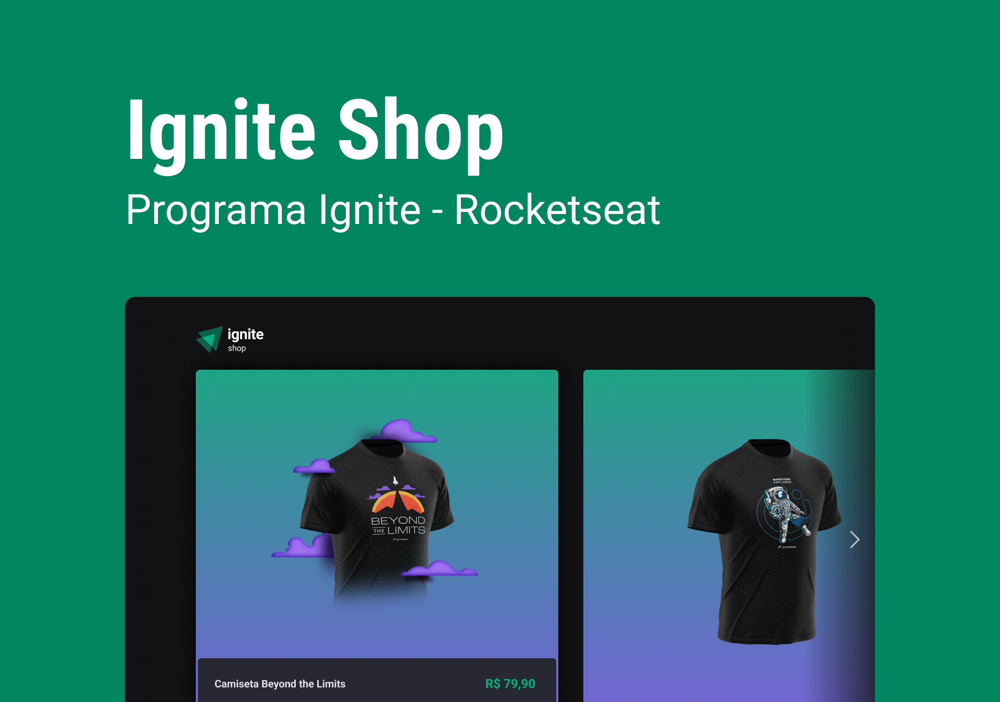

# Ignite Shop



## Rocketseat Ignite - Trilha React - Desafio Ignite Shop

O E-commerce lista os produtos cadastrados na plataforma Dashboard Stripe.

## Technology

- [Typescript](https://www.typescriptlang.org)
- [React](https://reactjs.org)
- [Next](https://nextjs.org/)
- [Stitches](https://stitches.dev/)
- [Keen Slider](https://keen-slider.io/)
- [React Toastify](https://fkhadra.github.io/react-toastify)
- [Phosphor React](https://phosphoricons.com/)
- [Axios](https://axios-http.com/)
- [Stripe](https://stripe.com/)
- [Use Shopping Cart](https://useshoppingcart.com/)

## Launch the application

### Locally

```sh
npm run dev
```

## Author

---

<a href="https://github.com/natasha-m-oliveira">
 
 <br />
 <sub><b>Natasha M Oliveira</b></sub></a> <a href="https://github.com/natasha-m-oliveira" title="Github">🚀</a>

👋🏽 Entre em contato!

[](https://www.linkedin.com/in/natasha-matos-oliveira/)
